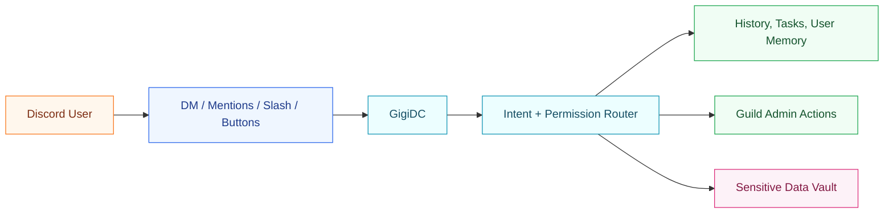
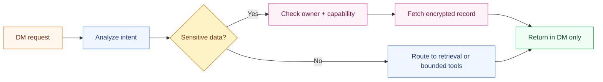

  

<h1 align="center">GigiDC</h1>

  
  
  
  
  
  

  Gigi is a personalized Discord bot for CS/IT Archive.

  <a href="https://gigi-f9937525.mintlify.app/"><strong>Read the official docs</strong></a>

Gigi gives CS/IT Archive members one consistent bot experience across DMs and server workflows.

## What GigiDC Offers

- Personalized DM-first interaction with mention-based channel chat
- Shared memory across supported workflows
- Permission-aware guild actions
- Sensitive-data disclosure in DM only

## Docs

- [Official docs](https://gigi-f9937525.mintlify.app/)
- [User guide](https://gigi-f9937525.mintlify.app/user-guide)
- [Using Gigi in Discord](https://gigi-f9937525.mintlify.app/discord-usage)
- [Permissions](https://gigi-f9937525.mintlify.app/permissions)
- [Architecture](https://gigi-f9937525.mintlify.app/architecture-v1)
