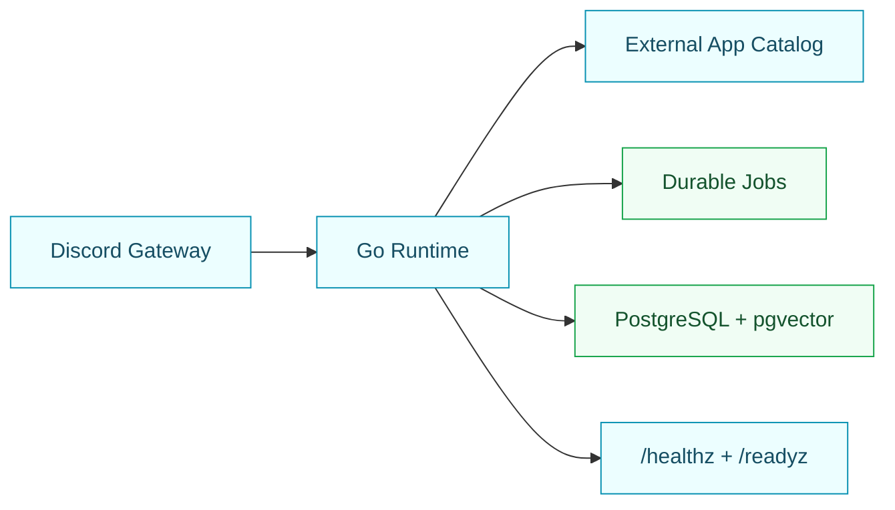

<p align="center">
  
</p>

<h1 align="center">GigiDC</h1>

<p align="center">
  <a href="https://gigi-f9937525.mintlify.app/">
    
  </a>
  
  
  
  
</p>

<p align="center">
  Gigi is being rebuilt as a Go-based Discord assistant foundation for CS/IT Archive.
</p>

## Current Foundation

This branch intentionally removes the old Node/Supabase runtime. The current Go foundation exposes health/readiness endpoints plus Discord `/ping`, DM `ping`, guild mention `ping`, role-first admin-gated `/permissions` capability grants, `/llm` guild provider and model management, `/plugins` manifest management, deterministic external app matching, semantic external app dry-run routing, guild mention chat fallback through a configured chat model, and opt-in public `send_message` prefix dispatch. LLM-backed guild mention behavior is live only when a guild credential, model profile, and `GIGI_LLM_SECRET_KEY_BASE64` are configured. Retrieval, memory, rich DM chat, reasoning chat, restricted dispatch, tasks, and relay actions are not live yet.



## Local Run

```bash
go test ./...
go vet ./...
go build ./cmd/gigi
docker compose -f compose.yaml up --build
```

Health checks:

```bash
curl http://127.0.0.1:8080/healthz
curl http://127.0.0.1:8080/readyz
```

## Coolify Rough Deploy

Use `docker-compose.yml`.

Required Coolify settings:

```txt
Build Pack: Docker Compose
Base Directory: /
Docker Compose Location: /docker-compose.yml
Service port: 8080
```

Required environment variable:

```txt
POSTGRES_PASSWORD=<secure database password>
```

Keep Discord off for the first smoke deploy:

```txt
GIGI_DISCORD_ENABLED=false
GIGI_DISCORD_SYNC_COMMANDS=false
```

After health checks pass, enable Discord with `DISCORD_TOKEN`, `DISCORD_CLIENT_ID`, and `GIGI_DISCORD_GUILD_ID` to test `/ping`, DMs, guild mentions, `/permissions`, `/llm`, and `/plugins`.

## Docs

- [Official docs](https://gigi-f9937525.mintlify.app/)
- [Bot commands](https://gigi-f9937525.mintlify.app/bot-commands)
- [Architecture](https://gigi-f9937525.mintlify.app/architecture)
- [Setup](https://gigi-f9937525.mintlify.app/setup)
- [CI/CD](https://gigi-f9937525.mintlify.app/ci-cd)
