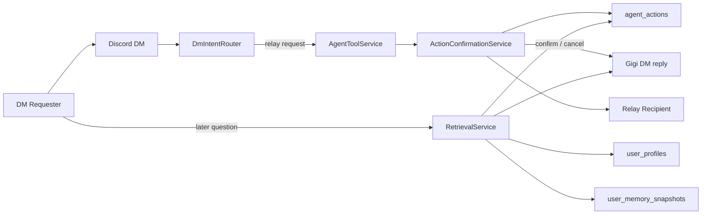

# DM Confirmation And User Memory Flow

This diagram captures the two new architectural seams added in this slice: persisted confirmation for cross-user relays, and bounded requester-centric memory snapshots for richer DM continuity.

## Reading Guide

- Cross-user relay requests do not execute immediately anymore. They become `agent_actions` rows that wait for explicit confirmation.
- `ActionConfirmationService` is the canonical place where confirm, cancel, expiry, permission re-checks, and final relay delivery happen.
- `user_profiles` stores stable requester identity facts for the primary guild, while `user_memory_snapshots` stores bounded derived summaries such as `identity_summary`, `working_context`, and `preferences`.
- Retrieval can now answer self-oriented DM questions from raw history plus participant-visible actions plus bounded user-memory snapshots.
- The snapshot layer is intentionally derived and expiring. It improves continuity, but it is not a substitute for source messages or action records.
