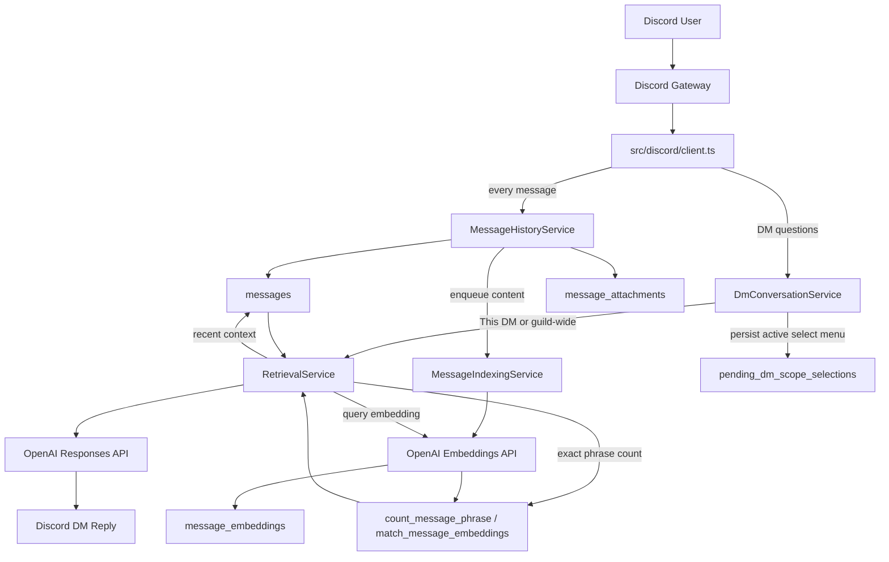

# DM Retrieval Flow

This diagram captures the current DM runtime path after the indexing and persistence upgrades: DM ingestion, durable scope selection, retrieval, and background embedding generation.

## Reading Guide

- DM messages are stored first, and embeddings are generated asynchronously through `MessageIndexingService` instead of inline on the gateway path.
- `DmConversationService` persists active select-menu state in `pending_dm_scope_selections`, so restarts no longer invalidate in-flight scope picks.
- DM handling and retrieval are separate concerns: `DmConversationService` decides scope, while `RetrievalService` decides answer strategy.
- Retrieval mixes exact and semantic paths. Phrase-count questions use RPC/database logic, while broader questions assemble recent and semantically matched context before asking OpenAI for the final response.
- Guild-wide history is only available after `RolePolicyService` approves the requester capability.
