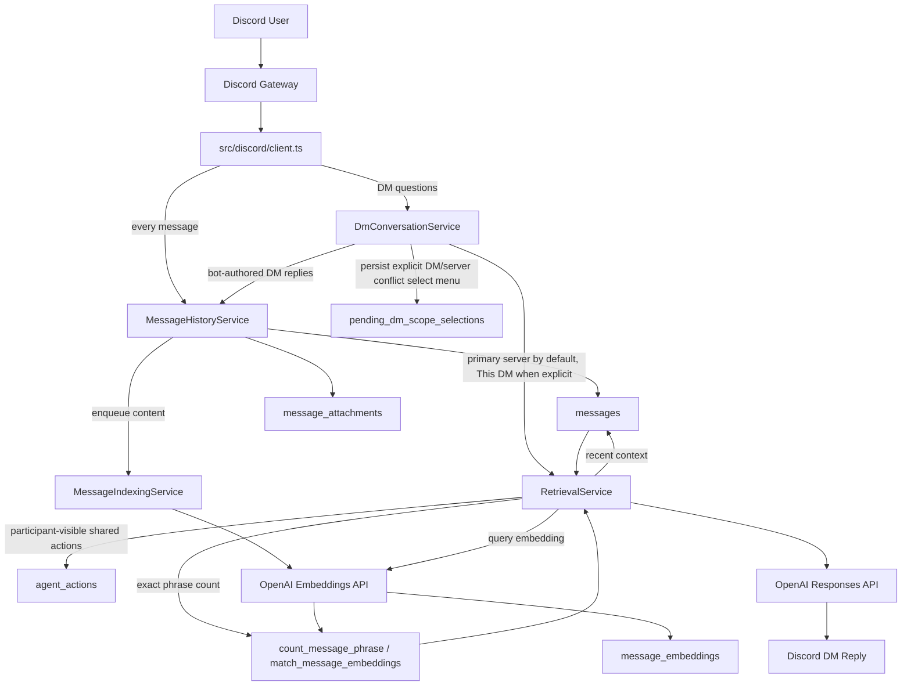

# DM Retrieval Flow

This diagram captures the current DM runtime path after the indexing, persistence, shared-identity, and primary-server-first retrieval upgrades: DM ingestion, optional scope disambiguation, participant-visible action lookup, retrieval, and background embedding generation.

## Reading Guide

- DM messages are stored first, and embeddings are generated asynchronously through `MessageIndexingService` instead of inline on the gateway path.
- `DmConversationService` defaults DM retrieval to the configured primary server for permitted members, and keeps explicit `this DM` phrasing on private DM history.
- `DmConversationService` persists select-menu state in `pending_dm_scope_selections` only when a user explicitly mixes DM and server scope in one request, so restarts no longer invalidate in-flight scope picks.
- DM handling and retrieval are separate concerns: `DmConversationService` decides scope, persists its own bot-authored replies immediately, and `RetrievalService` decides answer strategy and can merge participant-visible action memory with raw message history.
- Retrieval mixes exact and semantic paths. Phrase-count questions use RPC/database logic, while broader questions assemble recent and semantically matched context before asking OpenAI for the final response.
- Shared Gigi actions in `agent_actions` are a separate control-plane memory seam. They let requesters and recipients ask follow-up questions about relays even when no guild-wide raw history should be exposed.
- Primary-server history is only available after `RolePolicyService` approves the requester capability.
