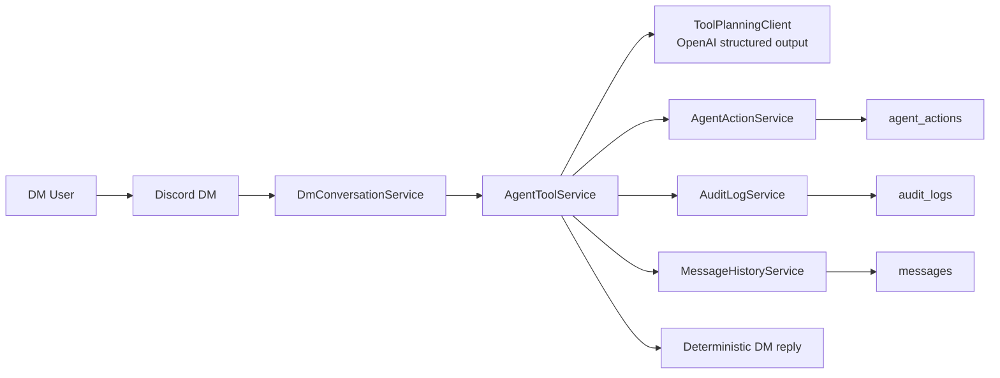

# DM Tool Execution Flow

This diagram captures the new step-3 runtime path: an explicit DM request can be planned into multiple internal tool calls, executed against the shared task/action substrate, and answered back in the same DM turn.

## Reading Guide

- `DmConversationService` now checks explicit tool-style requests before it falls back to retrieval.
- `AgentToolService` can execute up to three internal tool calls in one DM turn.
- The planner is bounded: it only targets internal task and relay tools, not arbitrary browser, shell, or external-provider actions.
- Task and relay execution still writes through `agent_actions`, so follow-up retrieval can recall what Gigi actually did.
- Audit and canonical message history are updated in the same tool path, which keeps permission denials, relay outcomes, and DM-visible replies traceable.
- This is still synchronous in-process orchestration. It is useful for short actions, but it is not yet a durable background worker system.
