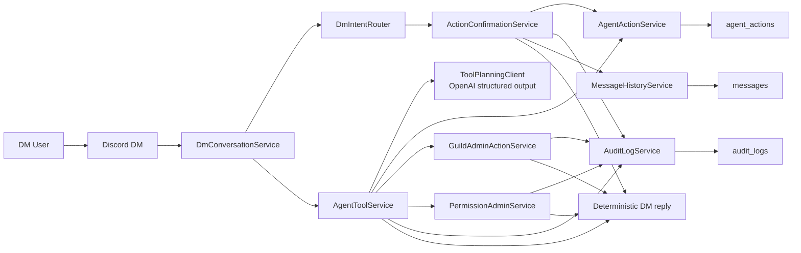

# DM Tool Execution Flow

This diagram captures the current DM runtime path: explicit DM requests can be routed deterministically, planned into bounded internal tool calls, and then executed through the shared-action path, the guild-admin path, or the permission-admin path. Cross-user relays still go through a real confirmation state instead of prompt-only approval theater.

## Reading Guide

- `DmConversationService` now runs a deterministic DM intent router before it touches the planner.
- `ActionConfirmationService` owns pending relay confirmation, button handling, and the free-text fallback for one unambiguous pending action.
- `AgentToolService` can execute up to three internal tool calls in one DM turn.
- The planner is bounded: it only targets internal task, relay, permission, ingestion, and assignment tools, not arbitrary browser, shell, or external-provider actions.
- `GuildAdminActionService` is the explicit seam for capability-gated guild/admin work from DM, which keeps DM execution aligned with the same permission model as slash commands.
- `PermissionAdminService` is the explicit seam for direct user capability grants, so direct permission overrides do not get mixed into unrelated guild-admin logic.
- Relay requests no longer jump straight from planner output to Discord DM send; they become `agent_actions` rows in `awaiting_confirmation` first.
- Task and relay execution still writes through `agent_actions`, so follow-up retrieval can recall what Gigi actually did.
- Audit and canonical message history are updated in the same tool path, which keeps permission denials, relay outcomes, DM-triggered permission changes, ingestion changes, assignment actions, and DM-visible replies traceable.
- This is still synchronous in-process orchestration. It is useful for short actions, but it is not yet a durable background worker system.
