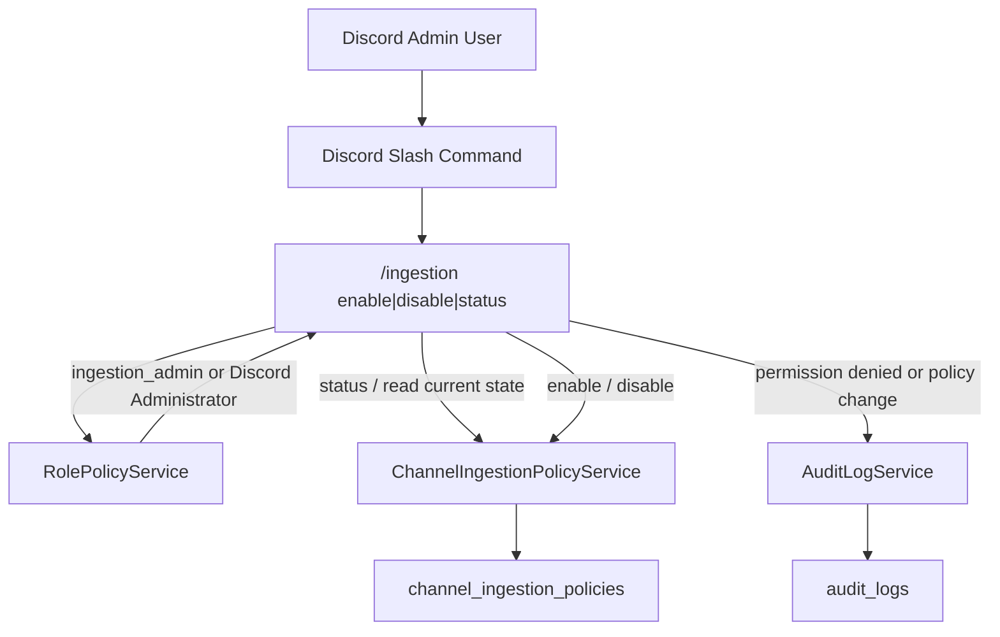

# Ingestion Policy Flow

This diagram captures the new admin path for channel-ingestion control: permission check, policy write, cache refresh, and audit logging.

## Reading Guide

- `ingestion_admin` is the explicit capability for changing retention behavior on guild channels.
- `ChannelIngestionPolicyService` now handles both reads and writes, and refreshes its cache after policy updates.
- Policy changes and denied admin attempts are written to `audit_logs` so ingestion-control decisions leave a trail.
- This flow is the current operability seam for guild-history retention.
