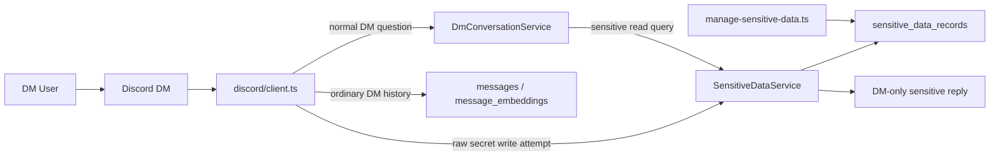

# Sensitive Data DM Flow

This diagram captures the new sensitive-data path: sensitive records live outside normal message history, are encrypted at rest, and are only disclosed in DM through a deterministic service path that bypasses OpenAI and embedding storage.

## Reading Guide

- Sensitive records are written through the local admin script, not normal Discord chat, so raw secret values do not have to pass through ordinary DM history storage.
- `SensitiveDataService` is the only runtime path that decrypts these records.
- Sensitive-data reads are deterministic and local. They do not call OpenAI and they do not use embeddings.
- Sensitive-data replies are intentionally not persisted into canonical bot-authored message history.
- The history-bypass detector is conservative, but it is still only a guardrail. Users should not treat ordinary DM chat as a high-assurance secret-ingestion channel.
