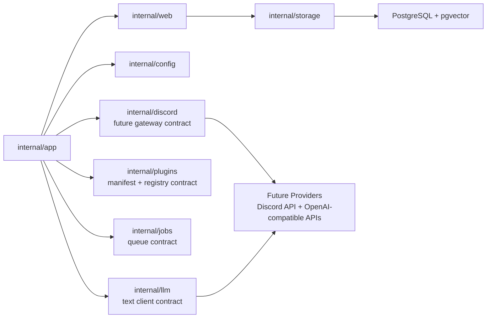

# Service And Adapter Boundaries

This diagram captures the current foundation seams. Most packages are contracts first, so later Discord, plugin, job, and LLM work can attach without rewriting the process shell.

## Reading Guide

- `internal/app` owns process lifecycle and graceful shutdown.
- `internal/web` owns HTTP health/readiness only.
- `internal/storage` currently checks DB reachability without taking a SQL dependency yet.
- `internal/plugins` defines plugin manifest shape: capabilities, triggers, surfaces, permissions, config schema, and attribution.
- `internal/jobs` defines durable work records before workers exist.
- `internal/discord` and `internal/llm` are narrow contracts only; no provider login or API call happens in this slice.
