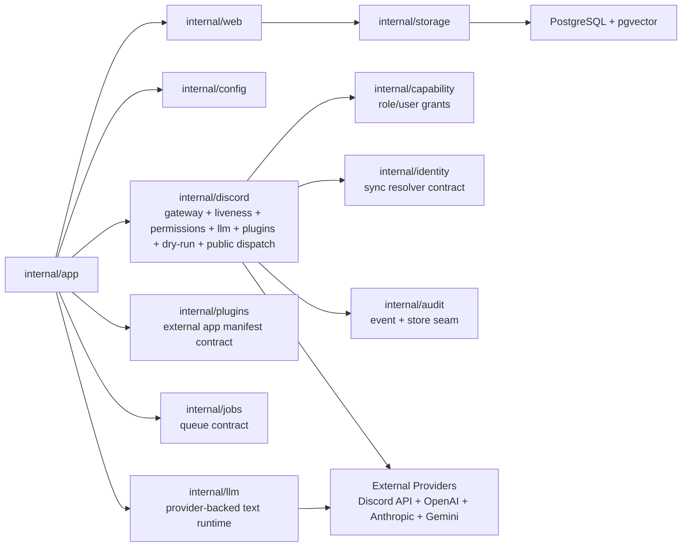

# Service And Adapter Boundaries

This diagram captures the current foundation seams. Discord liveness routing, permission grants, guild-scoped LLM controls, plugin catalog controls, external app dry-run matching, semantic dry-run routing, guild mention chat fallback, and consented opt-in public dispatch are live when configured; capability, identity, audit, external app manifest, job, retrieval, and memory packages provide contracts or foundations for later privileged behavior.

## Reading Guide

- `internal/app` owns process lifecycle and graceful shutdown.
- `internal/web` owns HTTP health/readiness only.
- `internal/storage` checks DB reachability and runs idempotent migration files at startup.
- `internal/capability` evaluates and manages user/role grants by Discord IDs, with explicit admin override.
- `internal/identity` defines fail-closed identity resolution for future privileged actions.
- `internal/audit` validates audit events and provides a durable audit-log store seam; `internal/agent` also persists sanitized run and step records for agent executions.
- `internal/plugins` defines external app manifest shape: capabilities, triggers, surfaces, permissions, config schema, and attribution.
- `internal/jobs` defines durable work records before workers exist.
- `internal/discord` has live `/ping`, DM `ping`, mention `ping`, `/permissions`, `/llm`, `/plugins`, external app dry-run planning, semantic dry-run routing, guild mention chat fallback, and consented public `send_message` prefix dispatch; rich DM chat and restricted dispatch are still future work.
- `internal/llm` resolves guild model profiles, calls configured providers, and records usage without storing raw prompts or completions.
