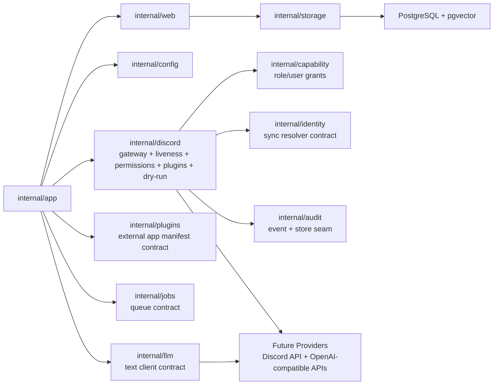

# Service And Adapter Boundaries

This diagram captures the current foundation seams. Discord liveness routing, permission grants, plugin catalog controls, and external app dry-run matching are live; capability, identity, audit, external app manifest, job, and LLM packages provide contracts or foundations for later privileged behavior.

## Reading Guide

- `internal/app` owns process lifecycle and graceful shutdown.
- `internal/web` owns HTTP health/readiness only.
- `internal/storage` checks DB reachability and runs idempotent migration files at startup.
- `internal/capability` evaluates and manages user/role grants by Discord IDs, with explicit admin override.
- `internal/identity` defines fail-closed identity resolution for future privileged actions.
- `internal/audit` validates audit events and provides a durable audit-log store seam.
- `internal/plugins` defines external app manifest shape: capabilities, triggers, surfaces, permissions, config schema, and attribution.
- `internal/jobs` defines durable work records before workers exist.
- `internal/discord` has live `/ping`, DM `ping`, mention `ping`, `/permissions`, `/plugins`, and external app dry-run planning; rich chat and command dispatch are still future work.
- `internal/llm` is a narrow contract only; no provider API call happens in this slice.
