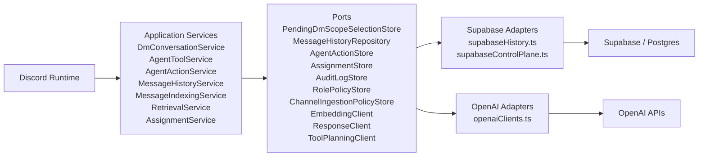

# Service And Adapter Boundaries

This diagram captures the current architecture seam that matters most for future upgrades: Discord-facing services depend on ports, and vendor-specific adapters sit behind those ports.

## Reading Guide

- `src/discord/client.ts` remains the runtime shell, but most behavior now lives behind service contracts.
- The service layer no longer imports Supabase or OpenAI SDK clients directly for core behavior.
- `pending_dm_scope_selections` moved DM menu state out of process memory and behind a store port.
- `agent_actions` gives the bot a durable control-plane seam for shared identity and tracked work without collapsing everything into unrestricted cross-channel retrieval.
- `ToolPlanningClient` keeps DM tool planning behind a port, so the service layer stays insulated from the exact structured-output wiring used by the OpenAI adapter.
- This is not full clean architecture yet, but it is the right seam for future background workers, tests, and provider changes.
