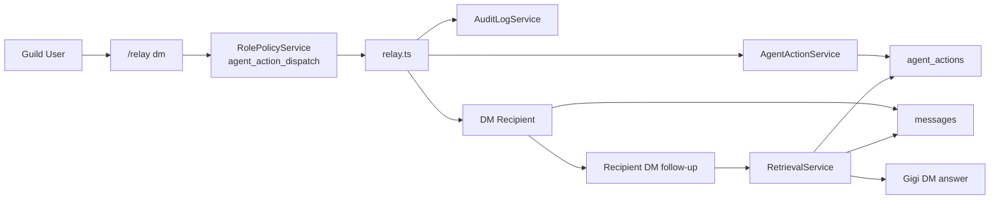

# Shared Identity Flow

This diagram captures the first concrete shared-identity workflow for GigiDC: a guild user asks Gigi to DM someone, Gigi records the action durably, and either participant can ask follow-up questions later in DM.

## Reading Guide

- `/relay dm` is the first explicit shared-identity command. It turns a user request into a durable `agent_actions` record before Gigi sends the outbound DM.
- `agent_action_dispatch` gates who can ask Gigi to create these cross-surface actions.
- `agent_actions` stores the requester, recipient, instructions, status, and safe metadata about what Gigi did.
- Successful relay deliveries are also written into canonical DM history, so follow-up questions can be answered from both the participant’s raw DM history and the participant-visible action record.
- This is the first shared-memory seam for GigiDC, but it is still permission-aware. It does not make all guild history available to everyone.
