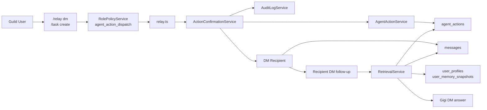

# Shared Identity Flow

This diagram captures the current shared-identity workflow for GigiDC: guild users can create relays or follow-up tasks, relays now wait for explicit confirmation, and participants can ask follow-up questions later in DM with bounded user-memory context.

## Reading Guide

- `/relay dm` and `/task create` are the first explicit shared-identity commands. They turn a user request into a durable `agent_actions` record before Gigi sends a relay or tracks open work.
- Cross-user relays now wait in `awaiting_confirmation` until the requester explicitly confirms or cancels them.
- `agent_action_dispatch` gates who can ask Gigi to create these cross-surface actions.
- `agent_actions` stores the requester, recipient or assignee, instructions, status, due date, and safe metadata about what Gigi did.
- `user_profiles` and `user_memory_snapshots` add a bounded requester-centric memory seam without widening raw guild-history exposure.
- Successful relay deliveries are also written into canonical DM history, so follow-up questions can be answered from both the participant’s raw DM history and the participant-visible action record.
- This is the first shared-memory seam for GigiDC, but it is still permission-aware. It does not make all guild history available to everyone.
