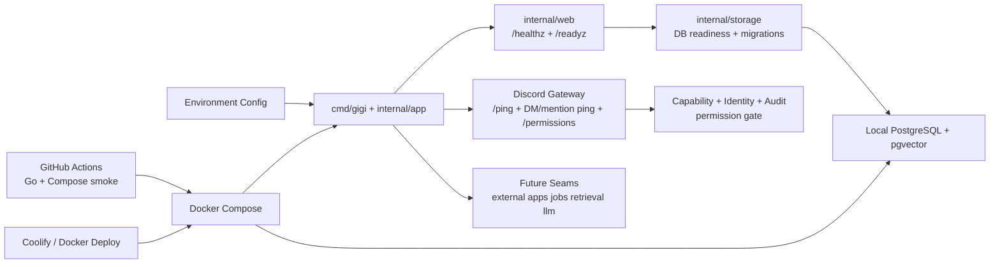

# System Overview

This overview reflects the current Go foundation. Health/readiness, Discord liveness routing, and permission grants run today; LLM, retrieval, and external app command execution remain foundations for later privileged behavior.

## Reading Guide

- The runtime starts from `cmd/gigi`, loads config, and serves HTTP.
- `/healthz` reports process/build health.
- `/readyz` fails closed unless required config exists and PostgreSQL is reachable.
- Discord liveness behavior is active when Discord is enabled.
- Capability, identity, and audit gate `/permissions`; external app, job, retrieval, and LLM packages are foundations for later privileged behavior.
- Docker Compose is the local and production deployment shape.

## Keep This Updated When

- command surfaces become live
- external app command execution becomes live
- job workers become live
- storage schema boundaries change
- deployment topology changes
