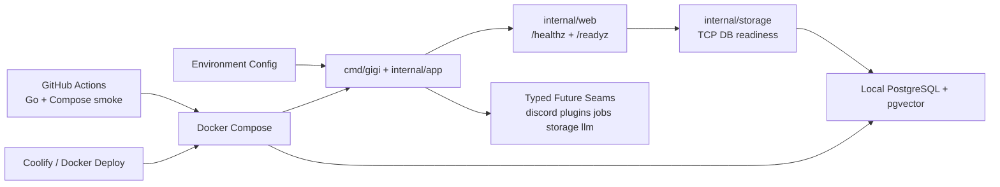

# System Overview

This overview reflects the current Go foundation. Discord, LLM, retrieval, and plugin execution are typed seams only; they do not run yet.

## Reading Guide

- The runtime starts from `cmd/gigi`, loads config, and serves HTTP.
- `/healthz` reports process/build health.
- `/readyz` fails closed unless required config exists and PostgreSQL is reachable.
- Future Discord, plugin, job, storage, and LLM behavior is represented as package contracts, not active behavior.
- Docker Compose is the local and production deployment shape.

## Keep This Updated When

- command surfaces become live
- plugin execution becomes live
- job workers become live
- storage schema boundaries change
- deployment topology changes
