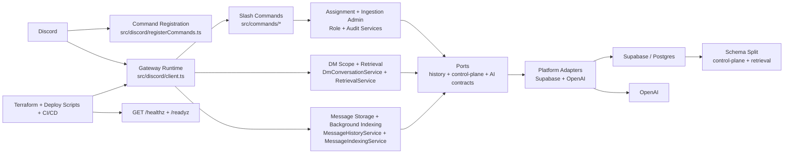

# System Overview

This overview has been refreshed from the first real `Understand-Anything` graph pass. It reflects the current repo shape rather than the earlier placeholder runtime sketch.

## Reading Guide

- The runtime entrypoints are small: startup, command registration, gateway handling, and health/readiness endpoints.
- Most behavior sits in services, especially the DM retrieval path and the admin command path for assignments and ingestion policy.
- The service layer now depends on explicit ports, with Supabase and OpenAI behind adapter boundaries rather than inside the services themselves.
- The storage layer is intentionally split between workflow state and retrieval state.
- Infrastructure is not incidental. Terraform, bootstrap scripts, release scripts, and CI/CD form a distinct operations surface around the bot.

## Keep This Updated When

- command surfaces change
- retrieval flow changes
- storage or schema boundaries change
- deployment topology changes
