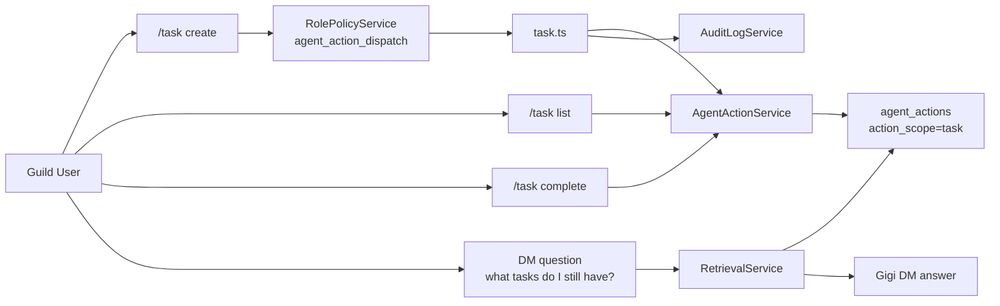

# Task Memory Flow

This diagram captures the new step-2 shared-identity layer: Gigi can now track open follow-up work in `agent_actions`, expose it through slash commands, and use it during DM retrieval.

## Reading Guide

- `agent_actions` is now a mixed task/action substrate instead of a relay-only log.
- Tasks use the same durable visibility model as relays, so assignees and requesters can recall them later without opening guild-wide history.
- Retrieval can assemble task context separately from chat history, which is the first move away from treating all memory as raw messages.
- This is still not a full orchestration system. It is a durable work-tracking seam that future tool execution can attach to.
