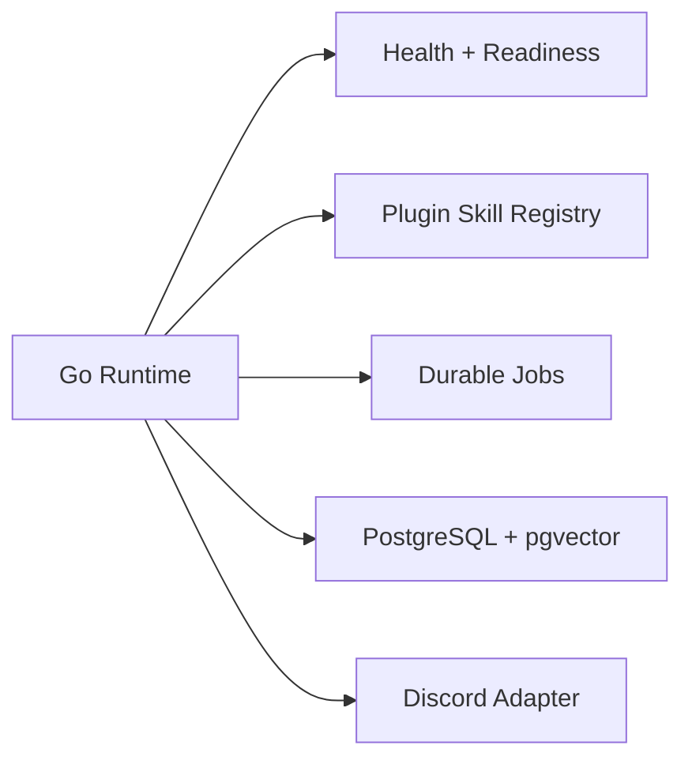

# GigiDC

GigiDC is being rebuilt as a Go service with Docker Compose, local PostgreSQL, pgvector, durable jobs, and a plugin-aware skill runtime.

<Note>
The old Node/Supabase runtime has been removed. The current foundation exposes health/readiness, Discord liveness routing, and admin-gated capability grants; LLM, retrieval, and plugin behavior will land in later slices.
</Note>

## Foundation Shape

## Start Here

- [Architecture](./architecture-v1)
- [Setup](./setup)
- [CI/CD](./ci-cd)
- [Coolify Deployment](./deploy-coolify)
