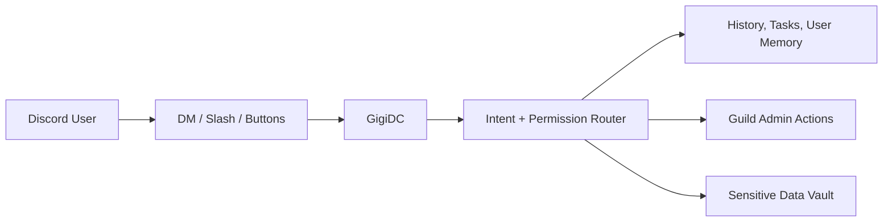

# GigiDC

  

Gigi is a personalized Discord bot for CS/IT Archive.

<Columns cols={2}>
  <Card title="User Guide" href="/user-guide">
    Learn how members should talk to Gigi in DM and in the server.
  </Card>
  <Card title="Discord Usage" href="/discord-usage">
    See real examples for tasks, relays, slash commands, and sensitive-data flows.
  </Card>
  <Card title="Get started" href="/setup">
    Set up the local bot, environment variables, and Discord app wiring.
  </Card>
  <Card title="Architecture" href="/architecture-v1">
    Understand the DM-first runtime, permissions, memory, and data boundaries.
  </Card>
  <Card title="Deploy" href="/deploy-ec2">
    Ship GigiDC to EC2 with the current release and service workflow.
  </Card>
  <Card title="Diagrams" href="/diagrams">
    Browse visual references for the main runtime and data flows.
  </Card>
</Columns>

## Core Capabilities

- DM-first interaction for questions, memory-aware follow-ups, and supported actions
- Permission-aware guild operations across DM and slash surfaces
- Shared task and action memory for continuity
- DM-only sensitive-data disclosure for the authorized user

## System Snapshot

## Explore The Docs

- [User Guide](./user-guide)
- [Using Gigi In Discord](./discord-usage)
- [Permissions](./permissions)
- [Setup](./setup)
- [Architecture](./architecture-v1)
- [Deployment](./deploy-ec2)
- [CI/CD](./ci-cd)
- [Diagrams](./diagrams/index)
