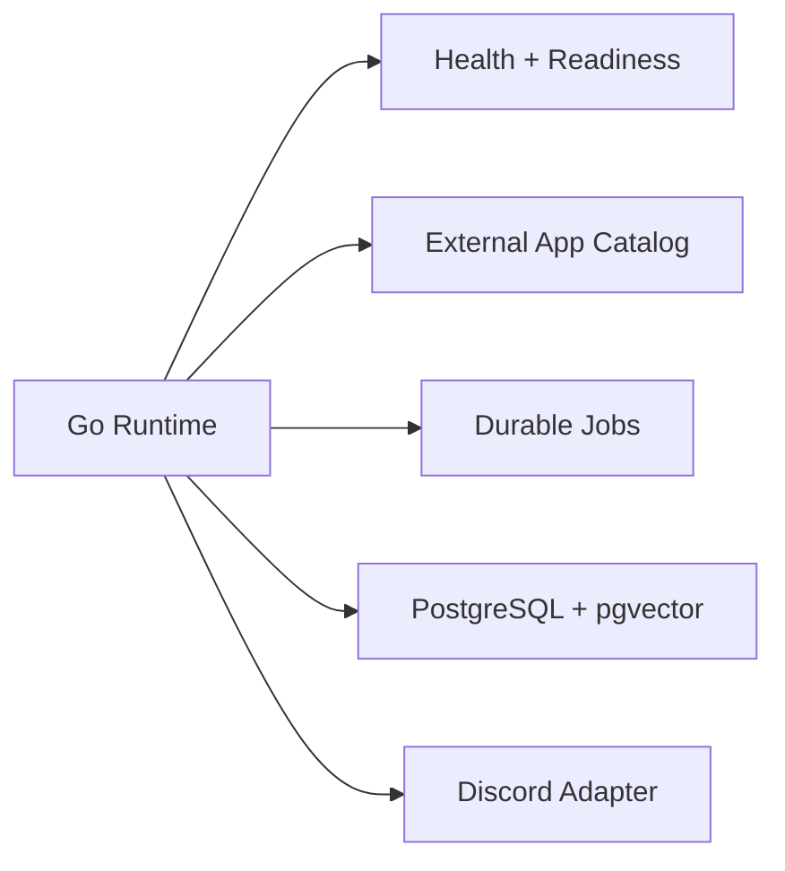

# GigiDC

GigiDC is being rebuilt as a Go service with Docker Compose, local PostgreSQL, pgvector, durable jobs, and an external Discord app integration layer.

<Note>
The old Node/Supabase runtime has been removed. The current foundation exposes health/readiness, Discord liveness routing, admin-gated capability grants, guild-scoped LLM provider setup, plugin catalog controls, deterministic and semantic external app dry-run routing, guild mention chat fallback through a configured chat model, and opt-in public external app dispatch. Retrieval, memory, rich DM chat, reasoning chat, and restricted action routing are not live yet.
</Note>

## Foundation Shape

## Start Here

- [User Guide](/user-guide)
- [Using Gigi In Discord](/discord-usage)
- [Setup](/setup)
- [Configure Discord](/configure-discord)
- [Configure LLM Providers](/configure-llm-providers)
- [Configure External App Plugins](/configure-plugins)
- [Coolify Deployment](/deploy-coolify)
- [Bot Commands](/bot-commands)
